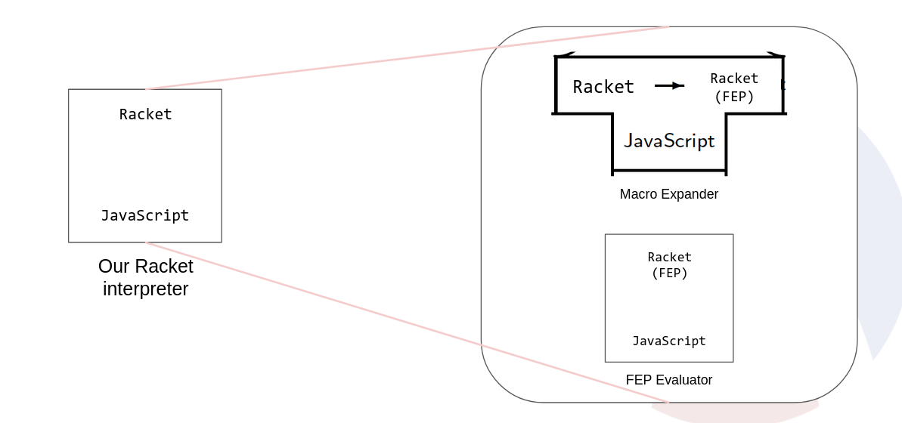

# Racket Interpreter Developer Documentation

This document is intended for developers. It has been written in the hope that it might help future developers navigate through Racket Interpreter's source code.

Racket Interpreter takes Racket code, compiles it to FEP, interpretes it as Javascript, and runs it.

The project has several [Entrypoints](#entrypoints), which use underlying functionality from the [Backend](#Backend).

# Key Components

## [Compiler](Compiler.md)

Compiler to compile Syntax to Fully Expanded Programs (FEP) using Syntax-transformers.

## [Evaluator](Evaluator.md)

Evaluator for Racket programs in FEP form.

## [Repl](Repl.md)

A CLI tool for running `*.rkt` files.

# Specifications

## [FEP](fep.md)
